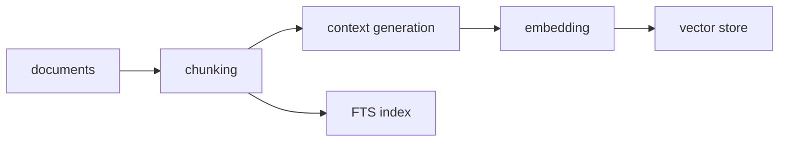
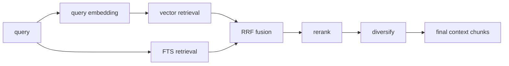

# sova — Local Document Semantic Search

*sova* — owl in Slavic languages.

## Quick Start

```bash
uv run sova-install                   # Build binary + set up llama-server services
sova index /path/to/your/pdfs         # Register + index project
sova projects                         # See project ids
sova <project-id> "your query"        # Search
```

Services start on demand — no memory used until you run a search or index.

## Under the Hood



PDFs are converted to Markdown, split into chunks, then indexed into two
retrieval artifacts: a vector store and an FTS index.

**Context generation** — at index time, a local LLM
(`ministral-3-14b-instruct-2512`) generates a one-sentence summary situating
each chunk within its document and section. This context is prepended to the
chunk text before embedding, so vectors capture meaning beyond the raw text [1].
The format is `[doc | section]\n\n{chunk_context}\n\n{chunk_text}`.

**Embedding + vector store** — contextualized chunk text is embedded with
`qwen3-embedding-4b` and stored for semantic retrieval.

**FTS index** — BM25 full-text retrieval catches exact terms that vectors can
miss. Porter stemming handles plurals and verb forms.



At search time, query embedding and FTS retrieval run in parallel. Their
candidates are fused with RRF [3], reranked by a cross-encoder
(`qwen3-reranker-0.6b`), then diversified. The output is a compact set of final
context chunks for answer generation.

**ToC detection** — chunks are classified at index time using text density [2].
ToC and index pages are flagged so they can be down-ranked at retrieval time.

**Semantic cache** returns cached results for similar queries (cosine > 0.92),
avoiding redundant embedding calls.

Models run locally via llama-server (llama.cpp): `qwen3-embedding-4b` for
embeddings (2560 dims), `ministral-3-14b-instruct-2512` for contextual summaries,
`qwen3-reranker-0.6b` for reranking. Services are managed as launchd agents
and start on demand.


## Usage

```bash
sova projects                         # List projects
sova index /path/to/pdfs              # Add project and index
sova index <project-id>               # Re-index existing project
sova <project-id> "your query"        # Semantic search (default mode)
sova <project-id> "query" -n 20       # More results
sova list <project-id>                # List docs and indexing status
sova reset <project-id>               # Delete DB and extracted files for project
sova remove <project-id>              # Remove project + local project data
sova remove <project-id> --keep-data  # Remove from registry, keep project data(md,db)
```

## Install / Remove

```bash
# Install: build binary, set up llama-server launchd services
uv run sova-install

# Remove: stop services, delete binary
uv run sova-remove
uv run sova-remove --purge-data       # Also delete ~/.sova
```

## Benchmarks

See `benchmarks/README.md` for details.

## References

[1] Anthropic, "[Contextual retrieval](https://www.anthropic.com/news/contextual-retrieval)," Anthropic Blog, 2024.

[2] C. Kohlschütter, P. Fankhauser, and W. Nejdl, "[Boilerplate detection using shallow text features](https://doi.org/10.1145/1718487.1718542)," *Proc. WSDM*, 2010.

[3] G. V. Cormack, C. L. A. Clarke, and S. Büttcher, "[Reciprocal rank fusion outperforms condorcet and individual rank learning methods](https://doi.org/10.1145/1571941.1572114)," *Proc. SIGIR*, 2009.

## Requirements

- [uv](https://docs.astral.sh/uv/) — Python package manager
- [llama.cpp](https://github.com/ggerganov/llama.cpp) — `llama-server` in PATH

## License

MIT
