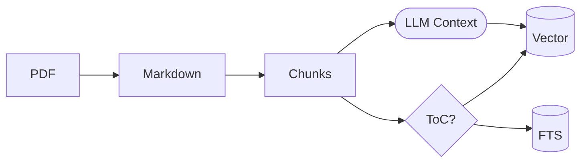
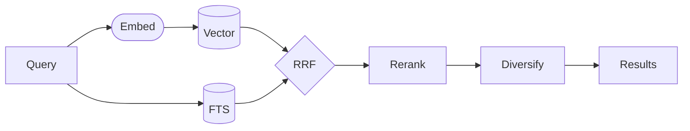

# sova — Local Document Semantic Search

*sova* — owl in Slavic languages.

## Quick Start

```bash
sova-install                          # Build binary + set up llama-server services
sova /path/to/your/pdfs               # Point at your PDFs (stored in ~/.sova)
sova -s "your query"                  # Search
```

## Usage

```bash
sova /path/to/pdfs                    # First run: set PDF source directory
sova                                  # Index (uses stored dir)
sova -s "your query"                  # Semantic search
sova -s "query" -n 20                 # More results
sova --list                           # List docs and status
sova --reset                          # Delete DB and extracted files
```

## Install / Remove

```bash
# Install: build binary, set up llama-server launchd services
uv run sova-install

# Remove: stop services, delete binary
uv run sova-remove
uv run sova-remove --purge-data       # Also delete ~/.sova/data
```

Services start on demand — no memory used until you run a search or index.

## Under the Hood



PDFs get converted to Markdown, split at header boundaries, and indexed two
ways.

**Contextual embeddings** — at index time, a local LLM (`ministral-3-14b-instruct-2512`) generates a
one-sentence summary situating each chunk within its document and section. This
context is prepended to the chunk text before embedding, so vectors capture
meaning beyond the raw text [1]. The format is
`[doc | section]\n\n{chunk_context}\n\n{chunk_text}`. Context generation is
incremental — just run `sova` and it fills in what's missing.

**BM25 full-text** catches exact terms that vectors miss. Porter stemming
handles plurals and verb forms.

**ToC detection** — chunks are classified at index time using text density [2].
ToC and index pages are flagged so they can be down-ranked at search time.



At search time, both results merge via RRF [3]. Top candidates are reranked
by a cross-encoder (`qwen3-reranker-0.6b`). Flagged ToC pages are down-ranked
so content chunks win. Results are diversified per document so you see multiple
sources.

**Semantic cache** returns cached results for similar queries (cosine > 0.92),
avoiding redundant embedding calls.

Models run locally via llama-server (llama.cpp): `qwen3-embedding-4b` for
embeddings (2560 dims), `ministral-3-14b-instruct-2512` for contextual summaries,
`qwen3-reranker-0.6b` for reranking. Services are managed as launchd agents
and start on demand.

## Benchmarks

See `benchmarks/README.md` for details.

## References

[1] Anthropic, "[Contextual retrieval](https://www.anthropic.com/news/contextual-retrieval)," Anthropic Blog, 2024.

[2] C. Kohlschütter, P. Fankhauser, and W. Nejdl, "[Boilerplate detection using shallow text features](https://doi.org/10.1145/1718487.1718542)," *Proc. WSDM*, 2010.

[3] G. V. Cormack, C. L. A. Clarke, and S. Büttcher, "[Reciprocal rank fusion outperforms condorcet and individual rank learning methods](https://doi.org/10.1145/1571941.1572114)," *Proc. SIGIR*, 2009.

## Requirements

- [uv](https://docs.astral.sh/uv/) — Python package manager
- [llama.cpp](https://github.com/ggerganov/llama.cpp) — `llama-server` in PATH

## License

MIT
