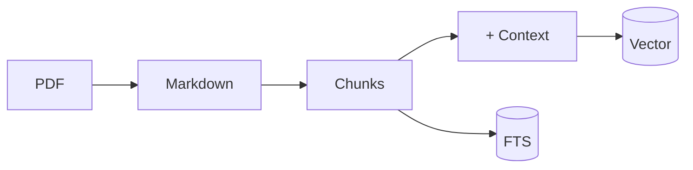
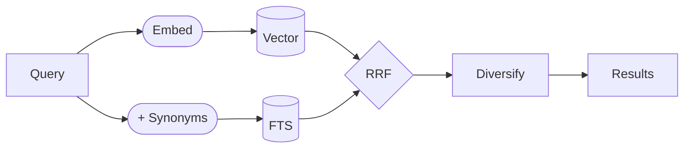

# sova — Local Document Semantic Search

```text
   ___
  (o o)
 (  V  )
/|  |  |\
  "   "
```

*sova* — owl in Slavic languages.

## Quick Start

```bash
ln -s /path/to/your/docs docs         # Symlink your documents
uv run sova                           # Index all PDFs
```

## Search

```bash
uv run sova -s "your query"           # Semantic search (with LLM expansion)
uv run sova -s "query" -n 10          # More results
uv run sova -s "query" --no-expand    # Disable query expansion
```

## Commands

```bash
uv run sova                        # Index all PDFs
uv run sova [doc...]               # Index specific docs
uv run sova --list                 # List docs and status
uv run sova --reset                # Delete DB and extracted files
```

## Under the Hood



PDFs get converted to Markdown, split at header boundaries, and indexed two ways.

**Contextual embeddings** prepend domain context to each chunk before embedding [7].
The LLM reads section titles and adds something like "From ARM interrupt handling
documentation." This helps vectors understand technical content without making
things up [6].

**BM25 full-text** catches exact terms that vectors miss. Porter stemming handles
plurals and verb forms.



At search time, both results merge via RRF [1]. Query expansion adds synonyms
through keywords only [2] — generating vector queries risks hallucinated terms [10].
ToC pages get down-ranked using text density [3]. Results are capped per document
so you see multiple sources, not five chunks from the same PDF [4][5].

Models run locally via Ollama: `qwen3-embedding:8b` for embeddings, `gemma3:4b`
for query expansion, `gemma3:12b` for domain detection.

## Non-Goals

A few techniques that sound good but don't work well here.

**HyDE** asks the LLM to imagine a relevant document, then searches for similar
ones. Clever idea, but it hallucinates on technical specs [6].

**Chunk overlap** — sliding windows with 20% overlap — adds indexing cost with
no quality gain [8]. Header-aware splits work better.

**Cross-encoder reranking** picks the "best" results but kills diversity. You get
five chunks from one doc instead of five docs [9].

**MMR** dynamically balances relevance and diversity. We prefer a simpler
guarantee: N unique docs first, then fill remaining slots [4][5].

## References

[1] G. V. Cormack, C. L. A. Clarke, and S. Büttcher, "[Reciprocal Rank Fusion Outperforms Condorcet and Individual Rank Learning Methods](https://doi.org/10.1145/1571941.1572114)," in *Proc. SIGIR*, Boston, MA, USA, 2009, pp. 758–759.

[2] R. Jagerman, H. Zhuang, Z. Qin, X. Wang, and M. Bendersky, "[Query Expansion by Prompting Large Language Models](https://doi.org/10.48550/arXiv.2305.03653)," in *Gen-IR@SIGIR*, 2023.

[3] C. Kohlschütter, P. Fankhauser, and W. Nejdl, "[Boilerplate Detection using Shallow Text Features](https://doi.org/10.1145/1718487.1718542)," in *Proc. WSDM*, New York, NY, USA, 2010, pp. 441–450.

[4] R. L. T. Santos, J. Peng, C. Macdonald, and I. Ounis, "[Explicit Search Result Diversification through Sub-queries](https://doi.org/10.1007/978-3-642-12275-0_11)," in *Proc. ECIR*, Milton Keynes, UK, 2010, pp. 87–99.

[5] C. L. A. Clarke, M. Kolla, G. V. Cormack, et al., "[Novelty and Diversity in Information Retrieval Evaluation](https://doi.org/10.1145/1390334.1390446)," in *Proc. SIGIR*, Singapore, 2008, pp. 659–666.

[6] L. Gao, X. Ma, J. Lin, and J. Callan, "[Precise Zero-Shot Dense Retrieval without Relevance Labels](https://aclanthology.org/2023.acl-long.99/)," in *Proc. ACL*, Toronto, Canada, 2023, pp. 1762–1777.

[7] Anthropic, "[Introducing Contextual Retrieval](https://www.anthropic.com/news/contextual-retrieval)," Anthropic Blog, Sep. 2024.

[8] S. Bennani and C. Moslonka, "[A Systematic Analysis of Chunking Strategies for Reliable Question Answering](https://arxiv.org/abs/2601.14123)," arXiv:2601.14123, Jan. 2026.

[9] T. Mordo, I. Reinman, M. Tennenholtz, and O. Kurland, "[Ameliorating the Herding Effect Driven by Search Engines using Diversity-Based Ranking](https://doi.org/10.1145/3731120.3744600)," in *Proc. ICTIR*, Washington, DC, USA, 2025.

[10] K. Abe, K. Takeoka, M. P. Kato, and M. Oyamada, "[LLM-based Query Expansion Fails for Unfamiliar and Ambiguous Queries](https://arxiv.org/abs/2505.12694)," in *Proc. SIGIR*, 2025.

## Requirements

- [uv](https://docs.astral.sh/uv/) — Python package manager
- [Ollama](https://ollama.ai) — running locally (models pulled automatically)

## License

MIT. Note: sqlite-vec uses Elastic License 2.0.
