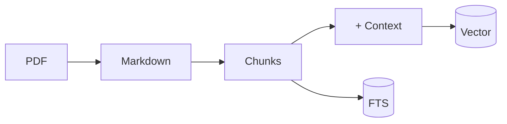
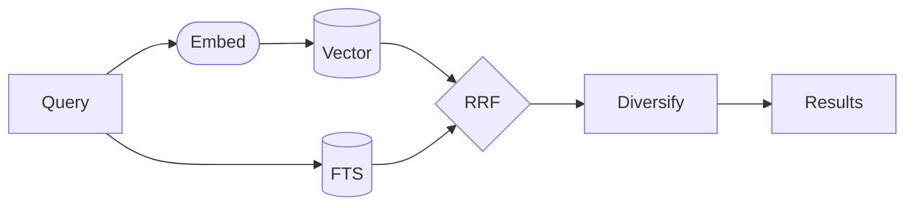

# sova — Local Document Semantic Search

```text
   ___
  (o o)
 (  V  )
/|  |  |\
  "   "
```

*sova* — owl in Slavic languages.

## Quick Start

```bash
ln -s /path/to/your/docs docs         # Symlink your documents
uv run sova                           # Index all PDFs
```

## Search

```bash
uv run sova -s "your query"           # Semantic search
uv run sova -s "query" -n 20          # More results
```

## Commands

```bash
uv run sova                        # Index all PDFs
uv run sova [doc...]               # Index specific docs
uv run sova --list                 # List docs and status
uv run sova --reset                # Delete DB and extracted files
uv run sova --clear-cache          # Clear semantic search cache
uv run sova --reset-context        # Regenerate LLM contexts on next run
```

## Under the Hood



PDFs get converted to Markdown, split at header boundaries, and indexed two
ways.

**Contextual embeddings** — at index time, a local LLM (`gemma3:12b`) generates a
one-sentence summary situating each chunk within its document and section. This
context is prepended to the chunk text before embedding, so vectors capture
meaning beyond the raw text [3]. The format is
`[doc | section]\n\n{llm_context}\n\n{chunk_text}`. Context generation is
incremental — just run `sova` and it fills in what's missing.

**BM25 full-text** catches exact terms that vectors miss. Porter stemming
handles plurals and verb forms.



At search time, both results merge via RRF [1]. ToC pages get down-ranked using
text density [2]. Results are capped per document so you see multiple sources.

**Semantic cache** returns cached results for similar queries (cosine > 0.92),
avoiding redundant embedding calls.

Models run locally via Ollama: `qwen3-embedding:4b` for embeddings (2560 dims),
`gemma3:12b` for contextual summaries. Both are pulled automatically on first
run.

## Benchmarks

```bash
uv run python -m benchmarks judge             # Generate ground truth
uv run python -m benchmarks judge --no-debias # Faster, skip debiasing
uv run python -m benchmarks run new-feature   # Run benchmark + latency
uv run python -m benchmarks show              # View results
uv run python -m benchmarks --help            # Full CLI help
```

See `benchmarks/README.md` for details.

## References

[1] G. V. Cormack, C. L. A. Clarke, and S. Büttcher, "[Reciprocal rank fusion outperforms condorcet and individual rank learning methods](https://doi.org/10.1145/1571941.1572114)," *Proc. SIGIR*, 2009.

[2] C. Kohlschütter, P. Fankhauser, and W. Nejdl, "[Boilerplate detection using shallow text features](https://doi.org/10.1145/1718487.1718542)," *Proc. WSDM*, 2010.

[3] Anthropic, "[Contextual retrieval](https://www.anthropic.com/news/contextual-retrieval)," Anthropic Blog, 2024.

## Requirements

- [uv](https://docs.astral.sh/uv/) — Python package manager
- [Ollama](https://ollama.ai) — running locally (models pulled automatically)

## License

MIT. Note: sqliteai-vector uses Elastic License 2.0.
