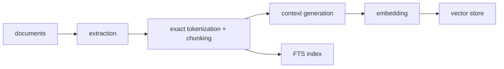
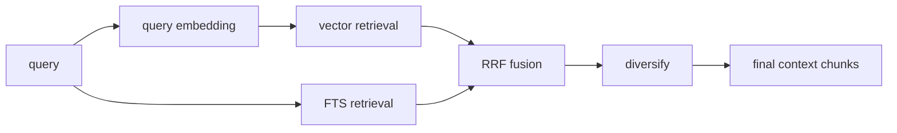

# sova — Local Document Semantic Search

*sova* — owl in Slavic languages.

## Quick Start

```bash
uv run sova-install            # Build binary + set up llama-server services
sova index /path/to/your/pdfs  # Register + index project
sova projects                  # See project ids
sova search <project-id> "your query"
```

Services start on demand — no memory used until you run a search or index.

## Under the Hood


```mermaid
flowchart LR
    A["documents"] --> X["extraction"]
    X --> B["exact tokenization + chunking"]
    B --> C["context generation"]
    C --> D["embedding"]
    D --> E["vector store"]
    B --> F["FTS index"]
```

PDFs are converted to Markdown, split into structure-aware chunks, then indexed
into two retrieval artifacts: a vector store and an FTS index. Headings are hard
boundaries through level five; deepest field labels remain in the text but may
coalesce into one chunk. Paragraph groups target an exact embedding-model token
budget, and each
chunk retains its full heading path. Code fences and code-like `#` comments are
not treated as document headings. An individual source line is never broken, so
a pathological generated table row may exceed the 768-token target while still
remaining below the embedding model's safe input limit.

Indexing is deliberately sequential on unified-memory machines: Sova unloads
both models while it prepares every source (including layout analysis and OCR),
briefly loads the embedding model to form exact tokenizer-aligned chunks, and
releases it. It then runs context generation and embedding as separate model
phases, unloading each model before the next. The source PDFs are read-only.

**Context generation** — at index time, a local LLM
(`qwen3.8-27b`) reads the complete target chunk and generates a one-sentence
summary situating it within the document and full heading path. This context is
prepended to the chunk text for both dense and lexical indexing, while the
stored source text remains unchanged [1]. Format:
`[doc | heading > path]\n\n{chunk_context}\n\n{chunk_text}`.

**Embedding + vector store** — contextualized chunk text is embedded with
`qwen3-embedding-4b` and stored for semantic retrieval.

**Contextual FTS index** — BM25 indexes the same document name, heading path,
generated context, and source chunk used by dense retrieval. It catches exact
terms and disambiguating document context that vectors can miss. Porter
stemming handles plurals and verb forms.


```mermaid
flowchart LR
    Q["query"] --> QE["query embedding"]
    QE --> VC["vector retrieval"]
    Q --> FC["FTS retrieval"]
    VC --> RRF["RRF fusion"]
    FC --> RRF
    RRF --> DV["diversify"]
    DV --> OUT["final context chunks"]
```

At search time, vector and FTS candidates are fused with RRF [3], then
diversified. The output is a compact set of final context chunks for answer
generation.

**ToC detection** — chunks are classified at index time using text density [2].
ToC and index pages are flagged so they can be down-ranked at retrieval time.

**Semantic cache** returns cached results for similar queries (cosine > 0.92),
avoiding redundant embedding calls.

Models run locally via llama-server (llama.cpp): `qwen3-embedding-4b` for
embeddings (2560 dims) and `qwen3.8-27b` for contextual summaries. Services are
managed as launchd agents and start on demand.


## Usage

```bash
sova help                              # Show unified help
sova projects                          # List projects
sova index /path/to/pdfs               # Add project and index
sova index <project-id>                # Re-index existing project
sova search <project-id> "your query"  # Semantic search
sova <project-id> "your query"         # Short search form
sova search <project-id> "query" -n 20 # More results
sova list <project-id>                 # List docs and indexing status
sova doctor <project-id>               # Read-only database integrity audit
sova remove <project-id>               # Unregister; keep local data
sova remove <project-id> --delete-data # Also delete local data (asks first)
```

Progress is updated in place in an interactive terminal. When output is piped,
Sova writes stable append-only status to stderr and results to stdout. Agents
and scripts can use newline-delimited JSON. Third-party converters and system
tools never write directly to the terminal; Sova captures their output and
reports failures through the same error format used by every command:

```bash
sova --json search <project-id> "your query"
sova --json doctor <project-id>
```

Indexing checkpoints each successful PDF conversion, tokenized document,
generated context, and embedding batch. Re-running the command reuses every
complete current-pipeline checkpoint without loading a model unnecessarily.
Changed PDFs are re-extracted, and documents removed from the source directory
are removed from the searchable index. Markdown files placed directly in the
source directory are also supported; generated Markdown under Sova's data
directory is never treated as a source document.

## Install / Remove

```bash
uv run sova-install              # Build binary + set up llama-server launchd services
uv run sova-remove               # Stop services and delete binary
uv run sova-remove --purge-data  # Also delete ~/.sova
```

## Benchmarks

See `benchmarks/README.md` for details.

## References

[1] Anthropic, "[Contextual retrieval](https://www.anthropic.com/news/contextual-retrieval)," Anthropic Blog, 2024.

[2] C. Kohlschütter, P. Fankhauser, and W. Nejdl, "[Boilerplate detection using shallow text features](https://doi.org/10.1145/1718487.1718542)," *Proc. WSDM*, 2010.

[3] G. V. Cormack, C. L. A. Clarke, and S. Büttcher, "[Reciprocal rank fusion outperforms condorcet and individual rank learning methods](https://doi.org/10.1145/1571941.1572114)," *Proc. SIGIR*, 2009.

## Requirements

- [uv](https://docs.astral.sh/uv/) — Python package manager
- [llama.cpp](https://github.com/ggerganov/llama.cpp) — `llama-server` in PATH

## License

MIT
