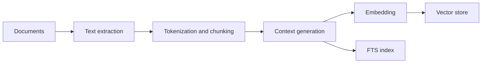
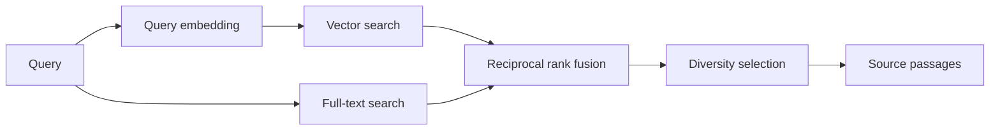

# Sova

Sova searches local PDF and Markdown documents by meaning and exact terms. It returns source passages with file locations. Models run locally through llama-server.

## Quick start

The installer requires macOS, Python 3.14 or later, [uv](https://docs.astral.sh/uv/), and [llama.cpp](https://github.com/ggerganov/llama.cpp) with `llama-server` in your `PATH`.

Run the installer from the repository directory:

```bash
uv run sova-install
```

It installs Sova in `~/.local/bin` and configures launchd model services. Add `~/.local/bin` to your `PATH`. Model services start on demand.

Index a document directory, then use its project ID to search:

```bash
sova index /path/to/documents
sova projects
sova search <project-id> "your query"
```

Sova reads `.pdf` and `.md` files directly in the source directory, without searching subdirectories. It keeps source files unchanged.

## Usage

```bash
sova help                             # Show help
sova projects                         # List projects and IDs
sova index <project-id>                # Update or resume indexing
sova list <project-id>                 # List documents and indexing status
sova search <project-id> "query"       # Return up to 10 results
sova search <project-id> "query" -n 20 # Return up to 20 results
sova <project-id> "query"              # Short search form
sova remove <project-id>               # Unregister the project. Keep its data
sova remove <project-id> --delete-data # Also delete project data after confirmation
```

Re-running `index` reuses completed work when the source and pipeline are unchanged. Sova saves progress after each PDF conversion, document tokenization, generated context, and embedding batch. It re-extracts changed PDFs and removes deleted source documents from the search index. Generated Markdown in Sova's data directory is not treated as a source document.

Progress updates in place in an interactive terminal. When output is piped, status goes to stderr and results to stdout. For agents and scripts, use newline-delimited JSON:

```bash
sova --json search <project-id> "your query"
```

See the [agent instruction example](SKILL.md.example) for a search workflow.

## How it works

### Indexing


```mermaid
flowchart LR
    A["Documents"] --> X["Text extraction"]
    X --> B["Tokenization and chunking"]
    B --> C["Context generation"]
    C --> D["Embedding"]
    D --> E["Vector store"]
    C --> F["FTS index"]
```

Sova converts PDFs to Markdown and splits documents into chunks using the embedding model's tokenizer, targeting 768 tokens per chunk. Headings through level five start new chunks, and each chunk keeps its full heading path. Code fences and code-like `#` comments are not treated as headings. Source lines stay intact, so a long table row can exceed the target.

At index time, `qwen3.8-27b` generates a one-sentence context for each chunk within its document and heading path [1]. Both search indexes use the document name, heading path, generated context, and source text. The stored source text stays unchanged.

`qwen3-embedding-4b` produces 2560-dimensional embeddings for vector search. The full-text search (FTS) index uses BM25 and Porter stemming to match exact terms and related word forms.

To limit memory use, Sova prepares sources, tokenizes documents, generates context, and embeds chunks in separate phases. Both models are unloaded during source preparation, including OCR. Each model is unloaded before the next phase.

### Search


```mermaid
flowchart LR
    Q["Query"] --> QE["Query embedding"]
    QE --> VC["Vector search"]
    Q --> FC["Full-text search"]
    VC --> RRF["Reciprocal rank fusion"]
    FC --> RRF
    RRF --> DV["Diversity selection"]
    DV --> OUT["Source passages"]
```

Sova combines vector and full-text results with reciprocal rank fusion [3]. Exact matches receive bonuses. Chunks resembling tables of contents or index pages receive penalties based on text density [2]. Diversity selection reduces similar passages in the output.

The semantic cache reuses vector candidates for similar queries at a cosine similarity of at least 0.92. Each query still needs an embedding. Full-text search and final ranking use the current query.

See the [benchmark guide](benchmarks/README.md) for recorded results and acceptance criteria.

## Remove Sova

Run from the repository directory:

```bash
uv run sova-remove              # Stop services and remove Sova. Keep project data
uv run sova-remove --purge-data # Also delete ~/.sova without confirmation
```

## References

[1] Anthropic, "[Contextual retrieval](https://www.anthropic.com/news/contextual-retrieval)," 2024.

[2] C. Kohlschütter, P. Fankhauser, and W. Nejdl, "[Boilerplate detection using shallow text features](https://doi.org/10.1145/1718487.1718542)," WSDM, 2010.

[3] G. V. Cormack, C. L. A. Clarke, and S. Büttcher, "[Reciprocal rank fusion outperforms condorcet and individual rank learning methods](https://doi.org/10.1145/1571941.1572114)," SIGIR, 2009.

## License

[MIT](LICENSE)
